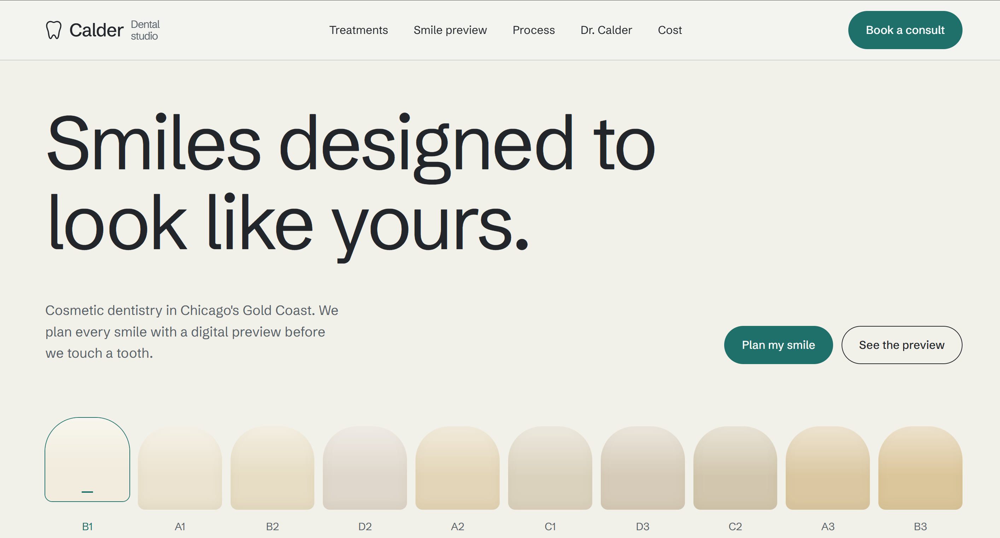

# Calder Dental Studio

**A website concept for a premium cosmetic dentistry practice in Chicago's Gold Coast.**
Designed with Figma AI from a written brief, then built in React and Tailwind CSS with purposeful motion.

[**Live demo**](https://calder-dental-demo.vercel.app/)

   



> **Concept project.** The practice, doctor, prices, phone number and email are fictional. Photography is AI-generated. The consult form is a front-end demo with no backend, and the before/after panel is an illustration, not patient photography.

---

## The idea: the shade guide

Most dental websites look the same: blue and white, stock smiles, vague promises. This one starts from the one object that is unique to cosmetic dentistry. When a dentist matches a porcelain veneer to a patient's teeth, they hold up a **shade guide**, a row of tooth-shaped tabs labelled B1, A2, C3 and so on.

The whole page is built around that object:

- **The hero is a shade guide.** Ten tooth-shaped tabs sit under the headline. Hovering a tab lifts it and softly tints the page; clicking selects it.
- **Your choice follows you.** The selected shade carries through the page: the "preview" side of the before/after panel, the veneer process copy, the FAQ answers and the "Target shade" in the consult form all update with it.
- **The page breathes with the scroll.** As you move through sections, the background tint shifts to a new shade.

It is a single interaction idea, used with restraint, so the page feels designed rather than decorated.

## Features

- Responsive from 390px phones to wide desktops
- Sticky header with an animated full-screen mobile menu
- Treatments listed as editorial rows with visit counts and "from" prices
- Draggable before/after smile preview (pointer and keyboard)
- Four-step veneer process with photography
- Doctor profile, written cost estimates and an animated FAQ accordion
- Consult form with validation (React Hook Form) and a clear "this does not book an appointment" note
- `Dentist` structured data (JSON-LD) for address and opening hours

## Design system

| Token | Value | Use |
| --- | --- | --- |
| Porcelain | `#F3F4F1` | Page background (cool, not cream) |
| Graphite | `#22262A` | Text and the consult section |
| Mute | `#586269` | Secondary text |
| Line | `#CDD2CF` | Hairline dividers |
| Lab teal | `#1F6F6B` | The single accent: buttons, links, selected state |

The ten shade tabs use warm neutrals from `#F1ECDD` (B1) to `#DBC59A` (B3), defined in `src/shade.jsx`.

**Typography:** [Schibsted Grotesk](https://fonts.google.com/specimen/Schibsted+Grotesk) only. Large, tight-tracked headlines; 17px body; no text under 15px; sentence case throughout.

Tokens live in the `@theme` block of `src/index.css`, so Tailwind utilities like `bg-porcelain`, `text-mute` and `border-line` work everywhere.

## Motion

Built with [Framer Motion](https://www.framer.com/motion/). Every animation respects `prefers-reduced-motion` through `MotionConfig reducedMotion="user"`.

| Moment | What happens |
| --- | --- |
| Page load | Headline lines rise out of a mask; shade tabs rise in a stagger |
| Shade tabs | Spring-physics lift on hover and select |
| Page tint | Background colour cross-fades to the active shade |
| Photography | Soft clip reveal with a slow zoom as images enter the viewport |
| Content | Sections fade up once, on first view |
| Before/after | Draggable handle with live shade preview |
| FAQ | Height and opacity animation; the plus icon rotates |
| Mobile menu | Panel slides in, links arrive one by one |

Animations use `transform` and `opacity` only, so they stay smooth on mid-range phones.

## Accessibility

- Shade tabs are real buttons with `aria-pressed` and a text label
- The comparison handle is a `role="slider"` with arrow-key support
- The shade description and form messages use `aria-live` / `role="status"`
- Visible keyboard focus on every interactive element
- Form fields have labels and inline error messages
- All images have descriptive alt text

## Performance

- Photos are WebP, sized to their slots, and lazy loaded; the hero has no image, so the largest paint is text
- The font loads without blocking render (`preload` with an `onload` swap and a `noscript` fallback)
- Production build: about 103 kB gzipped JavaScript and 5 kB gzipped CSS
- Lighthouse (mobile): _add your scores after deploying_

## Tech stack

- [React](https://react.dev/) 18 and [Vite](https://vitejs.dev/)
- [Tailwind CSS](https://tailwindcss.com/) v4
- [Framer Motion](https://www.framer.com/motion/)
- [React Hook Form](https://react-hook-form.com/)
- Schibsted Grotesk via Google Fonts

## Getting started

Requires Node.js 18 or newer.

```bash
npm install
npm run dev       # start the dev server
npm run build     # production build in dist/
npm run preview   # preview the production build locally
```

## Project structure

```
src/
├── assets/          WebP photography (clinic, scanner, ceramist, doctor, entrance)
├── App.jsx          page layout and global motion config
├── Header.jsx       sticky header and animated mobile menu
├── sections.jsx     Hero, Treatments, Preview, Process, Doctor, Cost, Faq, Footer
├── BeforeAfter.jsx  draggable comparison panel (SVG teeth)
├── Consult.jsx      consult form with validation
├── shade.jsx        shade list, shared selection state and scroll tint
├── ui.jsx           buttons, layout wrapper, reveal helpers
├── data.js          treatments, process steps, costs and FAQ copy
└── index.css        Tailwind import and design tokens
```

Copy and prices live in `src/data.js` and `src/sections.jsx`, so the site can be re-skinned for a real practice without touching the components.

## Process

1. **Brief:** a cosmetic dental practice for the US market, with a clear "no template" rule.
2. **Direction:** two concepts compared; "The Shade Guide" chosen for being specific to the subject.
3. **Design:** desktop, mobile and mobile menu generated in Figma AI from a detailed prompt.
4. **Review:** layout, copy and imagery checked against the brief and corrected (for example, US spelling and no AI-generated patient photos).
5. **Build:** React and Tailwind, with motion added in code where Figma can only annotate it.

## Deploying

Import the repository into [Vercel](https://vercel.com/) or Netlify. The build command is `npm run build` and the output directory is `dist`. The site is a single page, so no redirect rules are needed.

The page ships with `<meta name="robots" content="noindex">` on purpose, so a fictional practice does not appear in search results. Remove it for a real client.

## What a real client project would add

- Patient photography and real cases, shared with consent
- A real booking or request system, and a financing partner integration
- A dedicated page for each treatment
- Analytics, and an email provider for confirmations